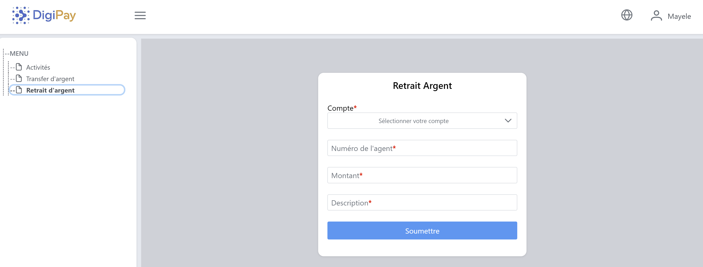

# spring_boot_client_app
VueJS client for  <a href="https://github.com/jeremielodi/spring_boot_client_app.git">spring_boot_app</a>.

# Description

Cette petite application nous sert de frontend pour l'application <a href="https://github.com/jeremielodi/spring_boot_client_app.git">spring_boot_app</a>.

Elle est conçue ne ```VueJS```. Cela signifie que vous aurez besoin de ```Nodejs``` pour la faire tourner.

J'ai utilisé la version v16.13.1 de node.

Vous trouverez la majorité des codes ecrits dans cette partie soulignée.


## Démarrage

Il faudra creer un fichier ```.env.js``` juste à la racine en copiant le contenu de ```.env.sample.js```. Cela que j'ai défini les ports du micro service (spring_boot_app) et celui de ce frontend.

Installer les packages nécessaires.

```shell
$ npm install
```
ou


```shell
$ yarn
```

Ensuite on peut maintenant faire tourner notre application cliente.

```shell
$ npm run serve
```
ou


```shell
$ yarn serve
```

## Quelques interfaces

### Authentification


<br/><br/>
<p>
Il faut signaler que je n'ai pas mis des confirmations pour l'opération de transfert ou de retrait, juste pour que mon code soit très lisible. Vu qu'ici je considère que le plus important est de démontrer comment consommer les APIs du micro service.
</p>
<br/>

### Activités


### Transfert


### Rétrait



<br/>

### Extrait d'utilisateur de ce template dans un autre project.

<a href="https://primefaces.org/primevue/setup">Thème</a>

